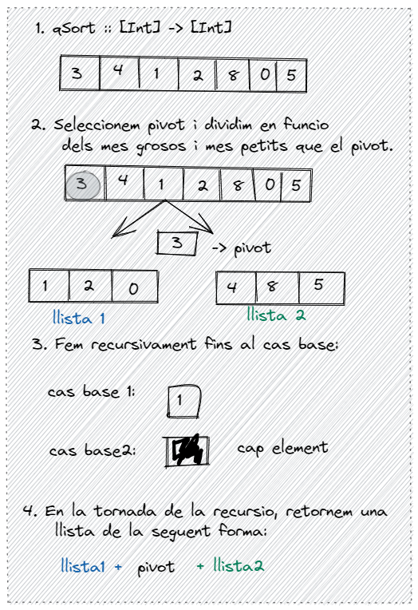

# Resum de Haskell

**Transparències de laboratori**: https://www.cs.upc.edu/~jpetit/Haskell/#1

---

## LAB 1: Recursivitat

**Exercisis proposats:**

+ [P77907](https://replit.com/@MarcNafria/Problems-in-Haskell#LAB01/P77907.hs) :white_check_mark:
+ [P25054](https://replit.com/@MarcNafria/Problems-in-Haskell#LAB01/P25054.hs) :white_check_mark:
+ [P29040](https://replit.com/@MarcNafria/Problems-in-Haskell#LAB01/P29040.hs) :white_check_mark:

---

## LAB 2: Funcions de ordre superior

`map` aplica una funció desitjada a cada element de una llista.

```haskell
map (*2) [1..4]
-- [2, 4, 6, 8]
```

`zipWith` combina dues llistes en una mitjançant una operació desitjada

```haskell\
-- funcio que combina dues llistes amb la suma dels seus respectius elements
a = zipWith (+) x y
```

`foldl` i `foldr` defineixen operadors, ja sigui per la dreta o per l'esquerra, que s'apliquen entre cada element de les llistes, ja sigui de dreta a esquerra o viceversa, i que dona com a resultat un element.

```haskell
-- l'element es de tipus corresponen a l'operador i els elements de la llista. Aquesta funció aplica l'operador (++) per la dreta a totes les subllistes. Per tant, retorna un allista amb tots els elements concatenats.
flatten :: [[Int]] -> [Int]
flatten = foldr (++) []
```

`filter` retorna una llista amb els element que compleixen un predicat concret.

```haskell
-- aquesta funció retorna una llista de tots els elements parells de a
filter (\x -> mod x 2 == 0) a
```

`iterate` genera una llista infinita de elements. `iterate f x = [x, f(x), f(f(x)), ...]`

```haskell
-- Aquesta funció genera una llista infinita de les potències de 2
powersOf2 :: [Int]
powersOf2 = iterate (* 2) 1
```

### Exercisis proposats:

#### P93632.hs

```haskell
-- 1. Implement a function eql :: [Int] -> [Int] -> Bool that tells wether two lists of integers are equal.
eql :: [Int] -> [Int] -> Bool
eql a b
  | length a == length b = and $ zipWith eql' a b
  | otherwise = False
  where
    eql' :: Int -> Int -> Bool
    eql' x y = x == y

-- 2. Implement a function prod :: [Int] -> Int that returns the product of a list of integers.
prod :: [Int] -> Int
prod = foldl (*) 1

-- 3. Implement a function prodOfEvens :: [Int] -> Int that returns the product of all even numbers of a list of integers.
prodOfEvens :: [Int] -> Int
prodOfEvens a = prod $ filter (\x -> mod x 2 == 0) a

-- 4. Implement a function powersOf2 :: [Int] that generates the list of all the powers of 2.
powersOf2 :: [Int]
powersOf2 = iterate (* 2) 1

-- 5. Implement a function scalarProduct :: [Float] -> [Float] -> Float that returns the dot product of two lists of float numbers with the same size.

scalarProduct :: [Float] -> [Float] -> Float
scalarProduct a b = sum $ zipWith (*) a b
```

---

## LAB 3: Llistes per comprensio i avaluacio mandrosa

Les llistes per comprensio s'assemblen al llenguatge matematic, i es creen amb definicions. Segueixen el format de `[valor | condicions i definicions]`. Les definicions diuen com son les variables que farem servir, i les condicions les filten.

### Exemples

`myMap f a = [f x | x <- a]` redefineix la funcio `map` com una llista en la que la variable x pren tots els valors de `a` i  el valor que resulta es calcula pasant aquest valor a una funcio `f` desitjada.

`myFilter cond a = [x | x <- a, cond x]`

`factors n = [x | x <- [1 .. n], mod n x == 0]`

### Exercicis proposats

#### P98957.hs

```haskell
-- Generate the sequence of ones [1,1,1,1,1,1,1,1,…].
ones :: [Integer]
ones = 1 : ones

-- Generate the sequence of the natural numbers [0,1,2,3,4,5,6,7…].
nats :: [Integer]
nats = 0 : map (+ 1) nats

-- Generate the sequence of the integer numbers [0,1,−1,2,−2,3,−3,4…].
ints' :: Integer -> Integer
ints' x
  | x > 0 = -x
  | x <= 0 = -x + 1

ints :: [Integer]
ints = 0 : map ints' ints

-- Generate the sequence of the triangular numbers: 0,1,3,6,10,15,21,28,…].
triangulars :: [Integer]
triangulars = scanl (+) 0 $ tail nats

-- Generate the sequence of the factorial numbers: [1,1,2,6,24,120,720,5040,…].
factorials :: [Integer]
factorials = scanl (*) 1 $ tail nats

-- Generate the sequence of the Fibonacci numbers: [0,1,1,2,3,5,8,13,…].
fibs = 0 : 1 : zipWith (+) fibs (tail fibs)

-- Generate the sequence of prime numbers: [2,3,5,7,11,13,17,19,…].
isPrime :: Integer -> Bool
isPrime 1 = False
isPrime n = isPrime' 2
  where
    isPrime' :: Integer -> Bool
    isPrime' d
      | d == n = True
      | mod n d == 0 = False
      | otherwise = isPrime' (d + 1)

primes :: [Integer]
primes = filter isPrime (drop 2 nats)
```

---

## LAB 5: Functor, Applicative i Monad

### Functor:

+ Functor és una classe de tipus que representa una **operació de mapeig sobre un tipus contenedor.**
+ Proporciona una única funció anomenada `fmap` (o `<$>`) que pren una funció i un valor Functor i aplica la funció als valors dins del Functor, mantenint l'estructura.
+ La classe de tipus Functor permet elevar funcions per a treballar amb valors dins del contenidor sense desempaquetar-los explícitament.
+ Exemples de Functors en Haskell són les llistes, Maybe i IO.

### Applicative:

+ Applicative és una classe de tipus que amplia les capacitats del Functor.
+ Proporciona una funció anomenada `pure` que encapsula un valor en el contexte Applicative.
+ També introdueix un operador `<*>` (o ap) que pren una funció encapsulada en el contexte Applicative i l'aplica als valors encapsulats en el mateix contexte.
+ Això permet aplicar funcions amb múltiples arguments a valors Applicative d'una manera convenient.
+ Exemples d'Applicatives en Haskell són Maybe i les llistes.

### Monad:

+ Monad és una altra classe de tipus que es basa en Applicative i Functor.
+ Proporciona una manera de seqüenciar càlculs mitjançant l'ús de l'operador `>>=` (bind).
+ Monad permet combinar càlculs que depenen de resultats anteriors enllaçant automàticament els valors intermedis.
+ També proporciona la funció return per encapsular un valor en el contexte Monad.
+ Exemples de Monads en Haskell són Maybe, IO i les llistes.

### Exercicis Proposats:

#### P87082.hs

```haskell
-- implementacio llegint per linea
main :: IO ()
main = do
    linea <- getLine
    let paraules = words linea
    let nom = paraules !! 0
    if nom /= "*" then do
        let imcCalculat = imc (read (paraules !! 1) :: Float) (read (paraules !! 2) :: Float)
        let resultat = imcAvaluarResultat imcCalculat
        putStrLn $ nom ++ ": " ++ resultat
        main
    else 
        return ()


-- funcio de IMC, donats dos floats saber el imc
imc :: Float ->  Float -> Float
imc p a = p / (a*a)

-- funcio de avaluacio, donat l'IMC saber l'string que identifica el resultat
imcAvaluarResultat :: Float -> String
imcAvaluarResultat x
    | x < 18 = "underweight"
    | x < 25 = "normal weight"
    | x < 30 = "overweight"
    | x < 40 = "obese"
    | otherwise = "severely obese"
```

---

## LAB 6: Entrada i sortida

### Resum IO:

> Per a entendre la entrada i sortida, que pot semblar algo molt sequencial, hem de pensar en el seguent exemple:
> Definim una estructura `data World` de la seguent manera:

```haskell
data World = ... -- descripció del món
myGetChar :: World -> (World, Char)
myPutChar :: Char -> World -> (World, ())
myMain :: World -> (World, ())
myMain w0 = let (w1, c1) = myGetChar w0
                (w2, c2) = myGetChar w1
                (w3, ()) = myPutChar c1 w2
                (w4, ()) = myPutChar c2 w3
            in  (w4, ())
```

> Podem veure que la funcio `myGetChar` es una funcio que donat un mon retorna un mon i un char. De forma inversa, la funcio `myPutChar` retorna un mon i un buit donats un mon i un char. D'aquesta manera podem pensar que les funcions d'entrada i sortida son funcions que modifiquen el mon. Aixi, podem simular una execucio en que llegim un char `c1` i un altre `c2` i generem un mon `w3` en el que hi posem el char `c1`. A partir d'aquest mon generem un altre on tambe hi posem el segon char `c2`.
> 
> Si canviem una mica el format en que escribim aixo, es veu mes clar el que pasa. Abans, farem que l'estructura `World` sigui instancio de `Monad` i el tipus `IO` es una transformacio d'un mon a un altre.

```haskell
type IO a = World -> (World, a)
getChar :: IO Char
putChar :: Char -> IO ()
main :: IO ()
main =
    getChar >>= \c1 ->
    getChar >>= \c2 ->
    putChar c1 >>
    putChar c2
```

> Encara mes clar, podem convertir el operador `bind` o `>>=` fent servir la notacio `do`:

```haskell
main = do
    c1 <- getChar
    c2 <- getChar
    putChar c1
    putChar c2
```

> Ara ja sabem que es el que pasa realment, i podem imaginar que, d'alguna manera, el sistema operatiu i la implementacio de haskell s'encarreguen de garantir que les funcions `getChar` i similars funcionin adecuadament. Realment, segueix sent un llenguatge declaratiu.

### Exercicis proposats:

#### P87974.hs

```haskell
main :: IO ()
main = do
  nom <- getLine
  let s = saludaAdeu nom
  putStrLn s

saludaAdeu :: String -> String
saludaAdeu [] = ""
saludaAdeu (x : _)
  | x == 'A' = "Hello!"
  | x == 'a' = "Hello!"
  | otherwise = "Bye!"
```

#### P87082.hs

```haskell
-- implementacio llegint per linea
main :: IO ()
main = do
    linea <- getLine
    let paraules = words linea
    let nom = paraules !! 0
    if nom /= "*" then do
        let imcCalculat = imc (read (paraules !! 1) :: Float) (read (paraules !! 2) :: Float)
        let resultat = imcAvaluarResultat imcCalculat
        putStrLn $ nom ++ ": " ++ resultat
        main
    else 
        return ()


-- funcio de IMC, donats dos floats saber el imc
imc :: Float ->  Float -> Float
imc p a = p / (a*a)

-- funcio de avaluacio, donat l'IMC saber l'string que identifica el resultat
imcAvaluarResultat :: Float -> String
imcAvaluarResultat x
    | x < 18 = "underweight"
    | x < 25 = "normal weight"
    | x < 30 = "overweight"
    | x < 40 = "obese"
    | otherwise = "severely obese"
```

---

## Examens passats resolts

### P48366

**1. Evaluació d'expressions postfix (eval1 i eval1')**

```haskell
eval1 :: String -> Int
eval1 s = eval1' [] (words s)

eval1' :: [Int] -> [String] -> Int
eval1' (x:_) [] = x
eval1' xs (y:ys)
    | y == "+" = eval1' ([((xs !! 0) + (xs !! 1))] ++ (tail $ tail xs)) ys
    | y == "-" = eval1' ([((xs !! 1) - (xs !! 0))] ++ (tail $ tail xs)) ys
    | y == "*" = eval1' ([((xs !! 0) * (xs !! 1))] ++ (tail $ tail xs)) ys
    | y == "/" = eval1' ([(div (xs !! 1) (xs !! 0))] ++ (tail $ tail xs)) ys
    | otherwise = eval1' ([(read y :: Int)] ++ xs) ys
```

Aquest codi implementa l'avaluació d'expressions en notació postfix utilitzant una pila com a llista. `eval1` pren una cadena en notació postfix i la divideix en paraules utilitzant `words s`. Llavors, crida `eval1'` amb una pila buida i la llista de paraules. `eval1'` és una funció auxiliar que pren la pila actual `xs` i la llista de paraules restants `ys`.

- Si `ys` està buida, retorna el valor a la part superior de la pila com a resultat.
- Si la primera paraula en `ys` és un operador (`+`, `-`, `*`, `/`), desapila els dos elements superiors de la pila, realitza l'operació corresponent i torna a apilar el resultat.
- Si la primera paraula és un valor, el converteix en un enter i el puja a la pila.

**2. Avaluació d'expressions postfix sense recursió (eval2)**

```haskell
eval2 :: String -> Int
eval2 s = head $ foldl operador [] (words s)
  where
    operador (x:y:ys) "+" = (y + x) : ys
    operador (x:y:ys) "-" = (y - x) : ys
    operador (x:y:ys) "*" = (y * x) : ys
    operador (x:y:ys) "/" = (y `div` x) : ys
    operador pila n = read n : pila
```

Aquesta funció realitza la mateixa tasca d'avaluació d'expressions postfix, però ho fa sense utilitzar la recursió. Utilitza la funció `foldl` per recórrer la llista de paraules i una pila. L'operador `operador` processa les operacions i valors, mantenint una pila actualitzada. La funció `head` retorna l'únic valor que queda a la pila al final, que és el resultat de l'expressió.

**3. Funció `fsmap`**

```haskell
fsmap :: a -> [a -> a] -> a
fsmap x fs = foldl (\acc f -> f acc) x fs
```

Aquesta funció pren un element `x` de tipus `a` i una llista de funcions `fs` de tipus `a -> a`. La funció `fsmap` aplica totes les funcions de la llista `fs` a l'element `x` d'esquerra a dreta utilitzant `foldl`. En altres paraules, aplica cada funció de la llista `fs` successivament a l'element `x`, utilitzant el resultat anterior com a entrada per a la següent funció.

**4. Divide and Conquer**

```haskell
divideNconquer :: (a -> Maybe b) -> (a -> (a, a)) -> (a -> (a, a) -> (b, b) -> b) -> a -> b
divideNconquer base divide conquer x = ...

qBase :: [Int] -> Maybe [Int]
qBase [] = Just []
qBase [x] = Just [x]
qBase xs = Nothing

qDivide :: [Int] -> ([Int], [Int])
qDivide [] = ([], [])
qDivide [x] = ([x], [])
qDivide (x:xs) = (filter (< x) xs, filter (>= x) xs)

qConquer :: [Int] -> ([Int], [Int]) -> ([Int], [Int]) -> [Int]
qConquer (x:_) _ (xs1, xs2) = (xs1 ++ [x] ++ xs2)

quickSort :: [Int] -> [Int]
quickSort v = divideNconquer (qBase) (qDivide) (qConquer) v
```

Aquestes funcions estan relacionades amb l'algorisme de QuickSort. La funció `divideNconquer` implementa la lògica de dividir i conquerir, utilitzant una funció `base` per a la condició de parada, una funció `divide` per a la divisió de la llista i una funció `conquer` per a la combinació dels resultats de les crides recursives. En aquest cas, es tracta de l'ordre de les funcions i l'ús d'una llista d'enters.



**5. Definició del tipus `Racional`**

```haskell
data Racional = Racional Integer Integer

instance Show Racional where
    show (Racional n d) = (show (div n denComu)) ++ "/" ++ (show (div d denComu))
        where
            denComu = gcd n d

instance Eq Racional where
    (Racional n1 d1) == (Racional n2 d2) = n1 * d2 == n2 * d1

racional :: Integer -> Integer -> Racional
racional n d = (Racional (div n denComu) (div d denComu))
    where
        denComu = gcd n d

numerador :: Racional -> Integer
numerador (Racional n d) = n

denominador :: Racional -> Integer
denominador (Racional n d) = d
```

Aquesta part defineix un tipus `Racional` que representa números racionals. S'implementa una instància `Show` per mostrar-los com una fracció reduïda, una instància `Eq` per comparar-los i algunes funcions auxiliars com `racional` per crear racionals a partir del numerador i denominador, i les funcions `numerador` i `denominador` per obtenir-los.

**6. Arbres de Calkin (arbres i llistes)**

```haskell
data Tree a = Node a (Tree a) (Tree a)

recXnivells :: Tree a -> [a]
recXnivells t = recXnivells' [t]
    where recXnivells' ((Node x fe fd):ts) = x:recXnivells' (ts ++ [fe, fd])
```

En aquesta part, es defineix un tipus d'arbre genèric `Tree a` que conté nodes amb valors de tipus `a`. La funció `recXnivells` recorre l'arbre per nivells, començant pel node arrel, i retorna una llista amb els elements de l'arbre en l'ordre en què es troben a cada nivell.

```haskell
racionals :: [Racional]
racionals = recXnivells (arbreCalkin 1 1)

arbreCalkin :: Integer -> Integer -> Tree Racional
arbreCalkin a b = Node ra l r
    where
        ra = racional a b
        l = arbreCalkin a (a + b)
        r = arbreCalkin (a + b) b
```

En aquesta part, es crea una llista de racionals `racionals` utilitzant l'arbre `arbreCalkin`. Aquest arbre és una representació de la seqüència de racionals de Calkin, que es construeix mitjançant fraccions reduïdes. La funció `recXnivells` s'aplica a l'arbre per obtenir una llista dels racionals en ordre.

### P91910.hs

```haskell
data Expr a
    = Val a
    | Var String
    | Sum (Expr a) (Expr a)
    | Sub (Expr a) (Expr a)
    | Mul (Expr a) (Expr a)
    deriving Show


eval :: (Num a) => SymTab a -> Expr a -> Maybe a
eval symTab (Var s) = get symTab s
eval symTab (Val x) = Just x

eval symTab (Sum a1 a2) = (+) <$> (eval symTab a1) <*> (eval symTab a2)
eval symTab (Sub a1 a2) = (-) <$> (eval symTab a1) <*> (eval symTab a2)
eval symTab (Mul a1 a2) = (*) <$> (eval symTab a1) <*> (eval symTab a2)
```

**_CHAT-GPT:_**

> En Haskell, `Maybe` és un tipus que representa la possibilitat de tenir un valor (`Just a`) o no tenir-lo (`Nothing`). Per realitzar operacions amb valors dins de `Maybe`, has de tractar aquest context de manera segura.
> 
> - `<$>` és un operador de fmap que et permet aplicar una funció a un valor dins d'un context `Maybe` (`Just`). Per exemple, pots usar `fmap` o `<$>` per aplicar una funció a un valor dins d'un `Maybe`, i si el valor és `Nothing`, la funció no s'aplica i s'obté `Nothing`.
> 
> - `<*>` és un operador d'aplicació que pren una funció continguda en un context `Maybe` i un valor contingut en un context `Maybe` i aplica la funció al valor si tots dos són `Just`. Si qualsevol d'ells és `Nothing`, el resultat és `Nothing`.
> 
> En el cas del teu codi, estàs treballant amb valors dins de `Maybe` quan avalues expressions. Per realitzar operacions aritmètiques (com la suma, la resta i la multiplicació), necessites aplicar aquestes operacions de manera segura als valors continguts en `Maybe`. Aquí és on `<$>` i `<*>` són útils:
> 
> - `<$>` s'utilitza per aplicar les operacions de manera segura als valors continguts en `Maybe`, si tots dos són `Just`. Si un d'ells és `Nothing`, el resultat és `Nothing`.
> 
> - `<*>` s'utilitza per aplicar funcions als valors continguts en `Maybe` de manera segura, novament si tots dos són `Just`. Si un és `Nothing`, el resultat és `Nothing`.
> 
> Aquests operadors permeten treballar amb els valors continguts en `Maybe` de forma segura i expressiva, sense necessitat de comprovar manualment si els valors són `Just` o `Nothing`.

Tambe es pot fer servir la funcio `liftM2` que donades dos monades i una funcio:

+ extreu el valor de dins de les dues monades

+ aplica la funcio a els valors extrets

+ encapsula el resultat en una nova monada
  La funcio `liftM2` s'ha d'importa (`import Control.Monad`) o es pot definir de la seguent manera:
  
  ```haskell
  -- liftM2 :: Monad m => (a -> a -> a) -> m a -> m a -> m a
  liftM2 f x y = do
    vx <- x
    vy <- y
    return $ f vx vy
  ```